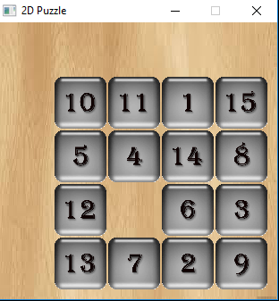
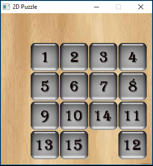

# NumberGame
The game is written in C++ and SDL is used for graphics.
To set up SDL in code::blocks, this link can be followed http://lazyfoo.net/tutorials/SDL/01_hello_SDL/windows/codeblocks/

The game will start with a 4x4 grid with numbers 1 to 15 in random cells.
The goal of the game is to arrange the numbers from 1 to 15 in the same order.
There is always one empty cell in the game. Any number which is adjacent to the empty cell can be moved to the empty cell by clicking on it.
Number blocks can also be moved by pressing 'w','a','s','d' or '8','2','4','6' on Numeric KeyPad.

Game can be reset using button '2' on keyboard.

The game will finish when you arrange all numbers in the ascending order.

